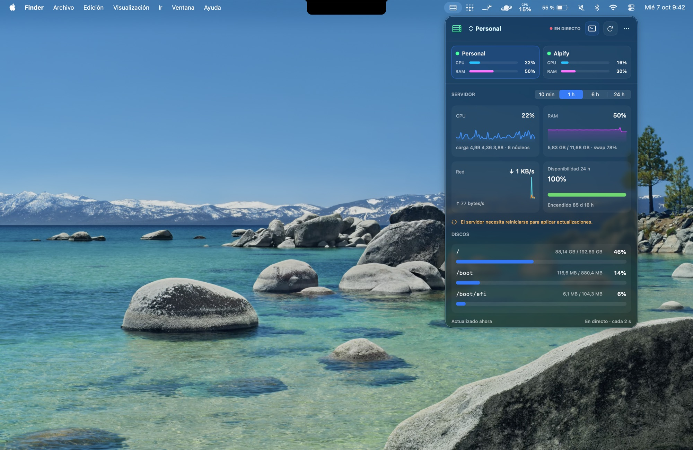
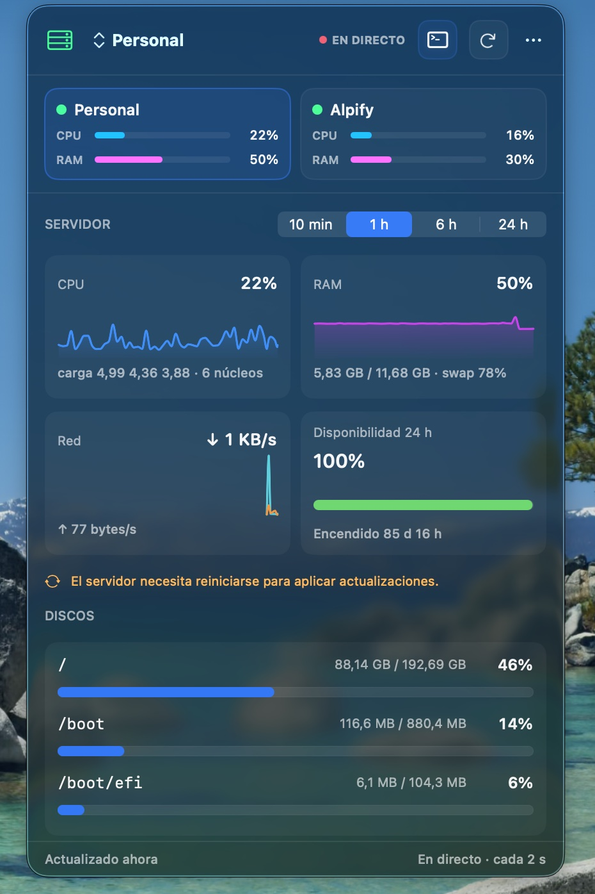
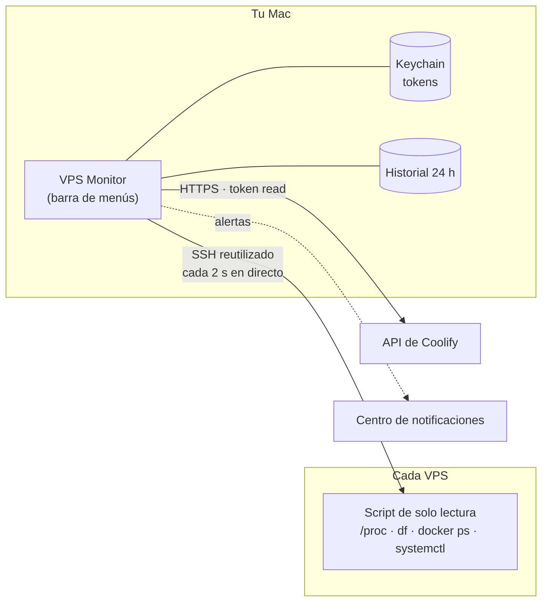

<div align="center">

# VPS Monitor

**Tus servidores, en directo, desde la barra de menús de tu Mac.**

Vigila uno o varios VPS Linux por SSH y sus recursos de Coolify, recibe alertas cuando algo falla y abre una sesión SSH con un clic.

[](https://github.com/Ibonarambarri/VPSMonitor/actions/workflows/ci.yml)




</div>

---

## Por qué VPS Monitor

- **Nada que instalar en el servidor.** Solo necesita acceso SSH: lee `/proc` con un script de solo lectura que se envía en cada comprobación.
- **En directo de verdad.** Con el panel abierto, el VPS seleccionado se actualiza cada 2 segundos sobre una única conexión SSH reutilizada.
- **Pensado para no molestar.** Las alertas exigen que el problema se mantenga, se resuelven solas con margen y no confunden el reposo de tu Mac o la falta de red con una caída del servidor.
- **Nativo y ligero.** SwiftUI, sin Electron, sin dependencias externas y sin icono en el Dock.

## Funciones

<table>
<tr>
<td width="56%" valign="top">

### 🖥️ Varios VPS a la vez
Cada servidor tiene su nombre, acceso SSH, Coolify, terminal y token propios. Todos se vigilan en segundo plano; las tarjetas superiores resumen cada uno y el icono de la barra de menús refleja el peor estado.

### 📈 Métricas completas
- CPU con *iowait* y *steal* (la CPU que te quita el proveedor)
- RAM y swap, carga y núcleos
- Red de bajada y subida
- Todos los discos montados
- Procesos que más CPU consumen
- Contenedores Docker y servicios systemd fallidos
- Aviso de reinicio pendiente y tiempo encendido

### 🕒 Historial de 24 horas
Gráficas de 10 min, 1 h, 6 h y 24 h que sobreviven a reinicios, con las caídas marcadas y la **disponibilidad real** ponderada por tiempo.

### 🔔 Alertas en macOS
Servidor sin respuesta, CPU o memoria altas sostenidas, disco casi lleno, *steal* elevado, contenedores o recursos de Coolify caídos y servicios systemd fallidos. También avisa cuando se resuelven.

### 🚀 Coolify y SSH
Proyectos, entornos y recursos de Coolify con enlaces directos. Abre SSH en Terminal, Warp o tu terminal favorita; copia el host o el comando SSH desde el menú.

</td>
<td width="44%" valign="top">

</td>
</tr>
</table>

## Instalación

Necesitas **macOS 13 o posterior** y Xcode 15+ o sus Command Line Tools (`xcode-select --install`).

```bash
git clone https://github.com/Ibonarambarri/VPSMonitor.git
cd VPSMonitor
zsh Scripts/install.sh
```

El instalador compila en modo *release*, instala `VPSMonitor.app` en `~/Applications`, activa el inicio automático y la abre. No lo ejecutes con `sudo`. Para actualizar, haz `git pull` y vuelve a ejecutarlo: la configuración se conserva.

> [!NOTE]
> La app se firma localmente, así que macOS la considera nueva tras cada compilación. Al abrir una versión nueva, Keychain puede pedir permiso una vez por token de Coolify: introduce tu contraseña y pulsa **Permitir siempre**.

## Primeros pasos

1. Pulsa el icono de servidor en la barra de menús y abre **Ajustes** desde el menú `⋯`.
2. Añade tus VPS con **+**. Para cada uno indica:
   - **SSH:** host, usuario, puerto y clave privada. La clave debe funcionar sin preguntar nada, así que conéctate una vez desde la terminal para aceptar la huella del host.
   - **Coolify** *(opcional)*: la URL base, sin `/api/v1`, y un token de API con permiso de solo lectura.
   - **Terminal:** Terminal de Apple, Warp o un lanzador personalizado.
3. Pulsa **Probar SSH** y **Probar Coolify** para comprobar el acceso antes de guardar.
4. En **Actualización y alertas**, elige cada cuánto se comprueba cada VPS, los umbrales de CPU, memoria y disco, y si quieres ver la CPU junto al icono.
5. Pulsa **Guardar y probar**.

La guía de [instalación y configuración](INSTALLATION.md) cubre las terminales compatibles, la desinstalación y la solución de problemas.

## Cómo funciona



| Situación | Comportamiento |
| --- | --- |
| Panel abierto | El VPS seleccionado se actualiza cada **2 s** |
| Panel cerrado | Cada VPS se comprueba cada 10 s, 30 s, 1 min o 5 min, según elijas |
| Una comprobación falla | Se repite en 15 s como máximo; el servidor se da por caído tras **2 fallos seguidos** |
| CPU o memoria por encima del umbral | Avisa solo si dura **3 minutos**; se resuelve al bajar 5 puntos |
| El Mac duerme o se queda sin red | Las comprobaciones se pausan y no cuentan como caída |
| Una orden remota se cuelga | Se corta a los 25 s; nunca bloquea las siguientes |

**Requisitos del servidor:** Linux con `procfs` y las utilidades POSIX habituales (`sh`, `awk`, `df`, `sort`). Funciona también con BusyBox y no depende de la shell del usuario remoto. Docker y systemd son opcionales: para ver los contenedores, el usuario SSH debe poder ejecutar `docker ps`.

## Seguridad y privacidad

- **Solo lectura.** VPS Monitor no modifica el servidor ni despliega nada en Coolify.
- Los tokens de Coolify se guardan en **Keychain** (`com.vpsmonitor.credentials.v3`, una cuenta por VPS).
- La clave SSH se usa desde su ubicación original y nunca se copia.
- El host, el usuario y las preferencias se guardan en `UserDefaults` (`com.vpsmonitor.app`). No contienen secretos, pero sí detalles de tu infraestructura.
- El historial guarda porcentajes y tasas de red por VPS en `~/Library/Application Support/VPSMonitor/`, sin nombres de host.
- La conexión SSH compartida usa un socket privado en `~/Library/Caches/vpsm` con permisos `0700`.
- Los argumentos de las sesiones SSH se validan y se pasan por separado, sin interpretarse como código de shell. El Tab Config de Warp se guarda con permisos `0600`.

Usa un usuario SSH con los mínimos privilegios, una clave dedicada y un token de Coolify de solo lectura.

## Actualizar desde versiones anteriores

Al instalar, se conserva la configuración de las versiones 1.1 y 1.2: los VPS, el VPS seleccionado, la terminal, los tokens de Keychain y la última hora de gráficas. Una instalación de la 1.1, que tenía un solo servidor, se convierte en un VPS llamado «Mi VPS».

## Desarrollo

Swift Package Manager, sin dependencias externas:

```bash
swift build
swift test
swift run VPSMonitor   # sin notificaciones: requieren la app instalada
```

También puedes abrir `Package.swift` en Xcode. GitHub Actions ejecuta `swift test` en macOS en cada *push*.

<details>
<summary>Pruebas de integración opcionales</summary>

Se omiten salvo que definas sus variables de entorno:

| Prueba | Variables |
| --- | --- |
| Coolify | `VPSMONITOR_TEST_COOLIFY_URL`, `VPSMONITOR_TEST_COOLIFY_TOKEN` |
| SSH | `VPSMONITOR_TEST_SSH_HOST`, `VPSMONITOR_TEST_SSH_KEY` y, opcionalmente, `VPSMONITOR_TEST_SSH_USER` y `VPSMONITOR_TEST_SSH_PORT` |

No guardes credenciales reales en el repositorio ni las expongas a flujos de CI que ejecuten código no confiable.

</details>

## Licencia

Este repositorio todavía no incluye un archivo de licencia. Su publicación como repositorio público no concede por sí sola permisos de uso, copia, modificación o redistribución.
